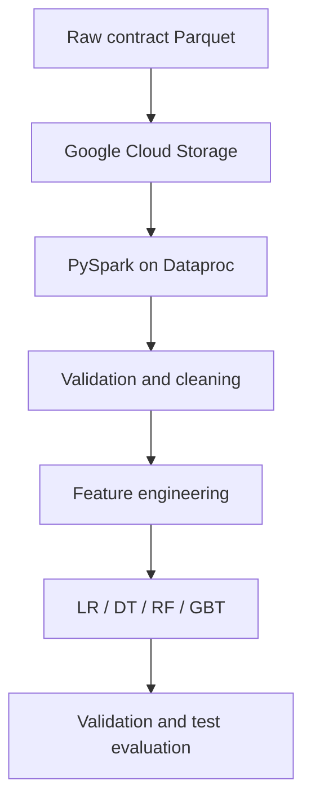

# Federal Contracts Big Data and Machine Learning

A large-scale Data Engineering and Machine Learning project built with PySpark, Google Cloud Storage, and GCP Dataproc.

## Objective

The project investigates whether characteristics of US federal contracts can help predict the number of offers received. The broader goal is to demonstrate a complete big-data workflow: ingestion, auditing, cleaning, feature engineering, distributed model training, and time-aware evaluation.

## Dataset

| Property | Value |
|---|---:|
| Records | Approximately 26,837,988 |
| Coverage | Fiscal years 2009–2024 |
| Storage format | Parquet |
| Compressed size | Approximately 2.3 GB |
| Uncompressed scale | More than 5 GB |
| Source identifier | `somaliscan/spending-archive` federal contracts |
| Primary target | `number_of_offers_received` |

Large datasets and generated feature vectors are stored in cloud object storage and are intentionally not committed to Git.

## Architecture

## Data Engineering work

- Normalized UUID and identifier columns
- Audited invalid dates, NAICS codes, PSC codes, duplicate IDs, and fiscal-year mismatches
- Removed invalid and sentinel-like monetary values
- Standardized categorical codes and organization names
- Derived NAICS and PSC sectors, duration, parent-award indicators, and time features
- Stored intermediate and model-ready data as Parquet in GCS
- Used Spark caching and persistence for repeated distributed operations
- Built vectorized features with StringIndexer, OneHotEncoder, Imputer, VectorAssembler, and StandardScaler

## Data-quality findings

The project treats missingness as a modelling constraint rather than hiding it. In the audited ML sample, approximately 69.21% of `number_of_offers_received` values were missing. Training and evaluation therefore use only records with a valid target while preserving the missingness analysis in project reporting.

Date audits also identified impossible historical and future years, and monetary fields contained extreme sentinel-like values near ±1 trillion. These values are handled explicitly during cleaning.

## Evaluation design

A time-based split reduces leakage from future contracts:

| Split | Years |
|---|---|
| Training | 2009–2022 |
| Validation | 2023 |
| Test | 2024 |

The regression workflow compares:

- Median constant-prediction baseline
- Linear Regression
- Decision Tree Regressor
- Random Forest Regressor
- Gradient-Boosted Tree Regressor

Models are evaluated with MAE, RMSE, and error analysis. Exact final metrics will be added only after the complete reproducible run is exported and verified.

## Exploratory analysis

The work includes contract volume and target availability by year, offer and award-value distributions, NAICS sectors, awarding agencies, competition and set-aside analysis, and log-transformed target relationships.

## Repository structure

| Path | Purpose |
|---|---|
| `notebooks/` | Auditing, EDA, feature engineering, and modelling notebooks |
| `src/` | Reusable PySpark pipeline modules |
| `results/` | Exported metrics, tables, and figures |
| `requirements.txt` | Local analysis dependencies |

## Reproduction plan

1. Create a GCP project, GCS bucket, and Dataproc cluster.
2. Place the source Parquet data in a raw/staging GCS prefix.
3. Configure dataset and output paths outside source code.
4. Run validation and cleaning before feature engineering.
5. Materialize the time-based train, validation, and test vectors.
6. Train the baseline and regression models.
7. Export metrics and figures to `results/`.

Cloud credentials, bucket data, trained Spark models, and multi-gigabyte artifacts must not be committed.

## Skills demonstrated

PySpark, Spark SQL, Spark ML, GCP Dataproc, GCS, distributed processing, Parquet, data-quality engineering, feature engineering, regression, time-aware validation, and large-scale exploratory analysis.

## Status

The original work was developed in cloud notebooks. This repository is being organized into reusable source modules and reproducible notebook stages. Final cleaned notebooks and exported metrics are the next additions.

## Author

Vaman Reddy — MSc IT & Data Science student with professional Data Engineering experience, seeking Data Engineering and ML/AI opportunities in Germany.

## License

No open-source license has been selected yet. Unless a license is added, reuse is not granted automatically.
