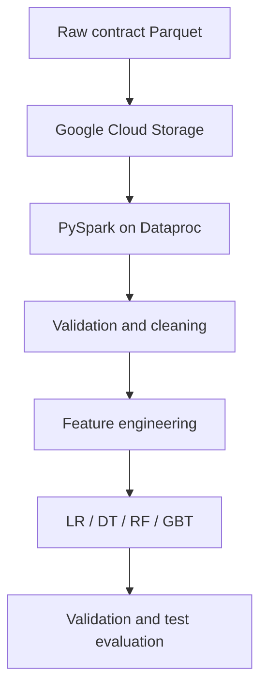

# Federal Contracts Big Data and Machine Learning

A large-scale Data Engineering and Machine Learning project built with PySpark, Google Cloud Storage, and GCP Dataproc.

## Objective

The project investigates whether characteristics of US federal contracts can help predict the number of offers received. The broader goal is to demonstrate a complete big-data workflow: ingestion, auditing, cleaning, feature engineering, distributed model training, and time-aware evaluation.

## Dataset

| Property | Value |
|---|---:|
| Records | Approximately 26,837,988 |
| Coverage | Fiscal years 2009–2024 |
| Storage format | Parquet |
| Compressed size | Approximately 2.3 GB |
| Uncompressed scale | More than 5 GB |
| Source identifier | `somaliscan/spending-archive` federal contracts |
| Primary target | `number_of_offers_received` |

Large datasets and generated feature vectors are stored in cloud object storage and are intentionally not committed to Git.

## Architecture



## Data Engineering work

- Normalized UUID and identifier columns
- Audited invalid dates, NAICS codes, PSC codes, duplicate IDs, and fiscal-year mismatches
- Removed invalid and sentinel-like monetary values
- Standardized categorical codes and organization names
- Derived NAICS and PSC sectors, duration, parent-award indicators, and time features
- Stored intermediate and model-ready data as Parquet in GCS
- Used Spark caching and persistence for repeated distributed operations
- Built vectorized features with StringIndexer, OneHotEncoder, Imputer, VectorAssembler, and StandardScaler

## Data-quality findings

The project treats missingness as a modelling constraint rather than hiding it. In the audited ML sample, approximately 69.21% of `number_of_offers_received` values were missing. Training and evaluation therefore use only records with a valid target while preserving the missingness analysis in project reporting.

Date audits also identified impossible historical and future years, and monetary fields contained extreme sentinel-like values near ±1 trillion. These values are handled explicitly during cleaning.

## Evaluation design

A time-based split reduces leakage from future contracts:

| Split | Years |
|---|---|
| Training | 2009–2022 |
| Validation | 2023 |
| Test | 2024 |

The regression workflow compares:

- Median constant-prediction baseline
- Linear Regression
- Decision Tree Regressor
- Random Forest Regressor
- Gradient-Boosted Tree Regressor

Models are evaluated with MAE, RMSE, R², log-RMSE, and error analysis.

## Verified results

### Number of offers - primary model

The model was selected using 2023 validation data and evaluated once on 1,656,042 target-valid records from 2024.

| Model | Test MAE | Test RMSE | Test R² | Log-RMSE |
|---|---:|---:|---:|---:|
| Decision Tree | **10.6024** | **62.1229** | **0.9338** | **0.5949** |
| GBT | 15.0215 | 75.1334 | 0.9032 | 0.6087 |
| Linear Regression | 58.1634 | 206.3918 | 0.2693 | 1.0281 |
| Random Forest | 62.6744 | 231.6313 | 0.0796 | 1.0054 |

The Decision Tree was selected from the 2023 validation results and remained the strongest model on the 2024 test set.

### Award value - secondary experiment

Linear Regression was selected using the 2023 validation set. On 4,420,560 target-valid 2024 records, it produced MAE 1,589,974.78, RMSE 140,701,943.22, R² 0.0016, and log-RMSE 1.9099. The very low R² is retained as an honest negative result: the selected features did not explain award-value variance well enough for a useful predictive model.

Machine-readable tables are available in [`results/`](results/).

## Exploratory analysis

The work includes contract volume and target availability by year, offer and award-value distributions, NAICS sectors, awarding agencies, competition and set-aside analysis, and log-transformed target relationships.

## Published portfolio evidence

The academic project execution is complete. The original work, including data auditing, cleaning, feature engineering, EDA, model training, and evaluation, was performed in cloud notebooks on GCP Dataproc.

Five sanitized, executed notebook exports and verified result tables are published in this repository. Databricks/Spark-monitor progress payloads were removed because they add size without adding technical evidence; meaningful tables, charts, and model outputs were retained.

## Repository structure

| Path | Purpose |
|---|---|
| `notebooks/01_data_cleaning_and_feature_engineering.ipynb` | Schema audit, cleaning, feature engineering, temporal splits, and vector preparation |
| `notebooks/02_date_quality_validation.ipynb` | Date-range auditing and secondary validation |
| `notebooks/03_exploratory_data_analysis.ipynb` | Distributed EDA and visual analysis |
| `notebooks/04_offers_model_evaluation.ipynb` | 2024 test evaluation and feature-importance analysis for the offer models |
| `notebooks/05_award_value_model_training_and_evaluation.ipynb` | Secondary award-value regression experiment |
| `results/` | Verified, machine-readable model metrics |
| `src/` | Planned reusable PySpark pipeline modules |
| `scripts/validate_notebooks.py` | Dependency-free portfolio integrity check |
| `docs/reproducibility.md` | Recorded environment, rerun prerequisites, and limitations |
| `.github/workflows/notebook-quality.yml` | Automated notebook and metrics validation |
| `requirements.txt` | Bounded local analysis dependencies |

## Automated validation

Run the repository integrity check without Spark or cloud credentials:

```bash
python scripts/validate_notebooks.py
```

The check validates notebook JSON and Python syntax, rejects committed error and Spark-monitor outputs, scans for common credential formats, and confirms the selected-model rows in both result tables. GitHub Actions runs the same command for pushes and pull requests.

## Reproduction plan

1. Create a GCP project, GCS bucket, and Dataproc cluster.
2. Place the source Parquet data in a raw/staging GCS prefix.
3. Copy `.env.example` to `.env`, configure your cloud paths, and adapt the exported notebooks' path cells.
4. Run validation and cleaning before feature engineering.
5. Materialize the time-based train, validation, and test vectors.
6. Train the baseline and regression models.
7. Export metrics and figures to `results/`.

Cloud credentials, bucket data, trained Spark models, and multi-gigabyte artifacts must not be committed.

See [`docs/reproducibility.md`](docs/reproducibility.md) for the recorded runtime, validation scope, full-rerun prerequisites, and explicit limitations.

## Skills demonstrated

PySpark, Spark SQL, Spark ML, GCP Dataproc, GCS, distributed processing, Parquet, data-quality engineering, feature engineering, regression, time-aware validation, and large-scale exploratory analysis.

## Status

- **Academic project execution:** Completed
- **Executed notebook evidence:** Published
- **Verified result tables:** Published
- **Automated evidence validation:** Implemented with GitHub Actions
- **Future engineering enhancement:** Extract reusable pipeline modules from the completed notebook workflow

## Author

Vaman Reddy — MSc IT & Data Science student with professional Data Engineering experience, seeking Data Engineering and ML/AI opportunities in Germany.

## License

No open-source license has been selected yet. Unless a license is added, reuse is not granted automatically.
